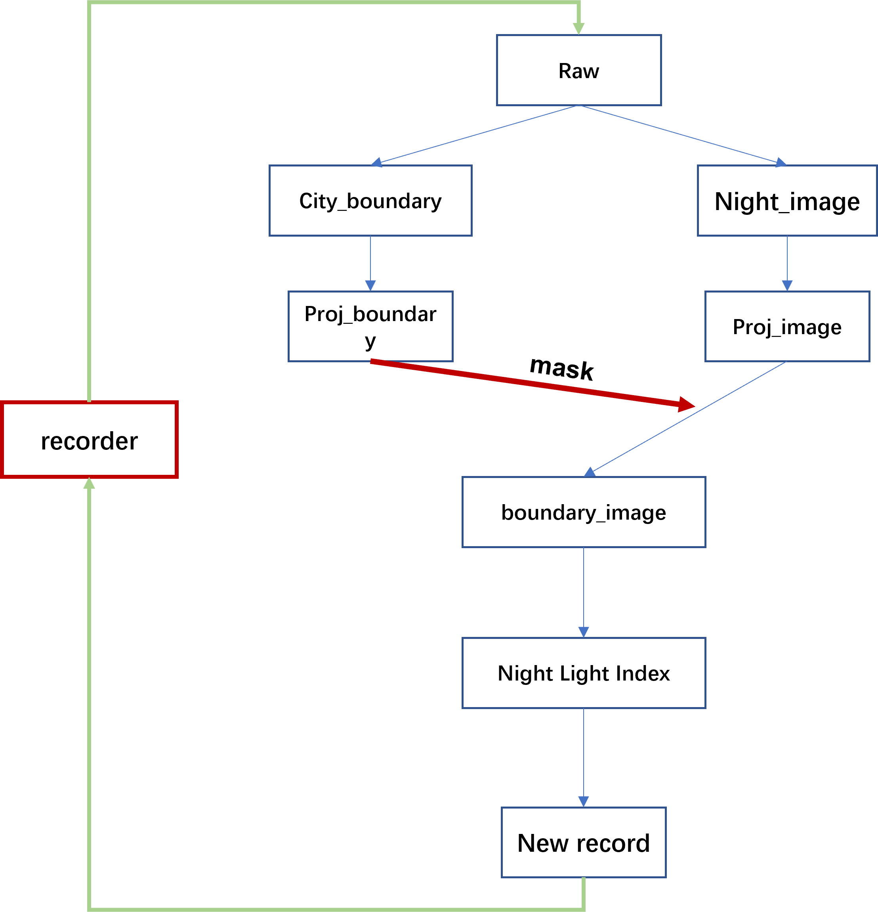

# Nighttime Image Processor
Calculate the Nighttime Light Index based on cities.

## Structure

## instruction
All the parameters that need to be modified are placed in the 'config' folder.
- image data: download from https://doi.org/10.7910/DVN/GIYGJU
- boundary data: download from https://www.cnopendata.com/data/m/government/chinese-administrative-divisions.html

- utils: some basic and simple functions such as projection transformer, city boundary extraction
- process: source code for processing nighttime light image

- main.py: when all the parameters(in static_vars) are configured, run "main.py" and the result will be saved in ./result/result.csv(auto-created folder)
## Data Source
Wu, Yizhen; Shi, Kaifang; Chen, Zuoqi ; Liu, Shirao; Chang, Zhijian, 2021, "An improved time-series DMSP-OLS-like data (1992-2022) in China by integrating DMSP-OLS and SNPP-VIIRS", https://doi.org/10.7910/DVN/GIYGJU, Harvard Dataverse, V4

## Concat
For any questions, please contact kingsleyl0107@gmail.com